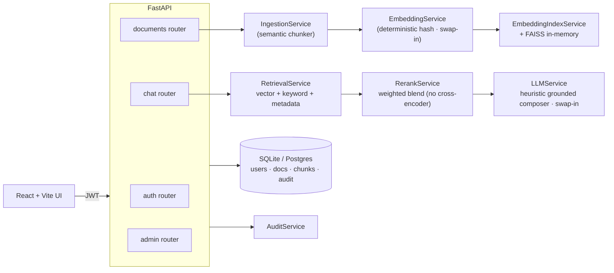

# Callisto — Enterprise RAG Knowledge Platform

> **One-liner:** A multi-tenant Retrieval-Augmented Generation (RAG) reference
> implementation that ingests documents, chunks and embeds them, and answers
> questions with inline citations — behind JWT auth and organization-scoped RBAC.

Callisto is a **local-demo portfolio project** by
[Ryan Bush](https://github.com/RyanJBush) (Information Science, University of
Maryland) that walks through the full RAG stack end-to-end: ingestion, chunking,
hybrid retrieval, weighted reranking, grounded answer assembly, multi-tenant
isolation, and a reproducible retrieval-evaluation harness. It is designed to
run locally in one command and be read end-to-end as a learning artifact — it
is **not** a hosted product and has no real users.

[**View UI / Design Preview →**](https://www.perplexity.ai/computer/a/callisto-preview-project-3-of-lCA5DWRgQoa4AN6VYPXAUQ)
(static UI walkthrough — not a live backend)

---

## Recruiter Demo in 2 Minutes

If you only have two minutes, do this:

```bash
git clone https://github.com/RyanJBush/Enterprise-RAG-knowledge-platform.git
cd Enterprise-RAG-knowledge-platform
docker compose up --build         # ~60-90s the first time
```

Then in a browser:

1. Open the API docs at **http://localhost:8000/docs** — 15 REST endpoints
   grouped by `auth`, `documents`, `chat`, `admin`, `health`.
2. Open the UI at **http://localhost:5173** and log in as
   `admin@calisto.ai` / `password123`.
3. Upload one of the seeded documents from `data/samples/` (or any plain text)
   on the **Documents** page.
4. Open the **Chat** page and ask:
   *"How many PTO days do employees get?"*
   You get back a grounded answer with inline citations (document title +
   chunk ID + snippet) plus a `latency_breakdown_ms` for retrieve / rerank /
   generate.
5. Log in as `viewer@calisto.ai` and confirm admin-only endpoints (e.g.
   `/api/admin/metrics`) return **403** — that's the RBAC layer working.

Full step-by-step recruiter / interviewer script with expected output is in
[docs/DEMO_RUNBOOK.md](docs/DEMO_RUNBOOK.md).

---

## Project Snapshot

Verified facts from the current repo:

| Item | Value |
|---|---|
| Project name | Callisto |
| Domain | Enterprise RAG knowledge platform (local demo) |
| Backend | FastAPI · SQLAlchemy 2.0 · Pydantic · Alembic · numpy · faiss-cpu · pypdf |
| Frontend | React 18 · Vite · Tailwind · axios · react-router |
| Storage | SQLite (default) / PostgreSQL via `DATABASE_URL` |
| Auth | JWT (python-jose) · passlib + bcrypt |
| REST endpoints | 15 across `auth`, `documents`, `chat`, `admin`, `health` |
| Frontend pages | Login, Dashboard, Documents, Chat, Settings (admin/RBAC) |
| Backend test files | 3 (`test_api.py`, `test_services_extended.py`, `test_utils_coverage.py`), ~100 cases |
| Eval set size | 6 labeled queries (`data/samples/eval_set.json`) |
| Embeddings | Deterministic 32-dim SHA-256 hash (demo-safe, no API key) |
| Answer generation | Heuristic grounded composer (no real LLM call) |
| Reranker | Weighted blend of vector / keyword / title / metadata signals (no cross-encoder) |
| Vector index | In-memory FAISS, rebuilt on startup |
| Infra | Docker · Docker Compose · GitHub Actions · Makefile |
| License | MIT |

---

## What This Project Demonstrates

For reviewers skimming for signal — what this repo actually proves I can do:

- **End-to-end RAG plumbing.** Ingestion → chunking → embedding → indexing →
  hybrid retrieval → weighted reranking → grounded answer with citations →
  audit log, all wired together as real code instead of slideware.
- **Layered backend design.** A 15-endpoint FastAPI app cleanly split into
  `routers/ → services/ → models/`, with Pydantic schemas at the HTTP boundary
  and SQLAlchemy 2.0 entities for persistence.
- **Production-shaped interfaces, demo-safe defaults.** `EmbeddingService`,
  `LLMService`, `VectorStore`, and `RerankService` are explicit seams; the
  current implementations are intentionally simple so the demo runs offline,
  and the production swap-in points are documented.
- **Multi-tenant isolation and RBAC.** Every domain table carries
  `organization_id`; every service query filters by it; FastAPI dependencies
  enforce `admin` / `member` / `viewer` roles; per-document access grants
  layer on top.
- **Operational hygiene.** Alembic migrations, an audit log, an in-memory
  rate limiter, request metrics, structured logging, Docker Compose for the
  full stack, and a GitHub Actions CI pipeline.
- **Evaluation discipline.** A labeled 6-query eval set plus a script that
  reports source hit-rate, keyword coverage, and latency — so changes to
  chunking or embeddings can be A/B tested against a baseline.

---

## Screenshots / Demo

UI screenshots have **not** been captured yet for the published repo. The
target captures live under [`docs/screenshots/`](docs/screenshots) and are
listed in [docs/screenshots/README.md](docs/screenshots/README.md):

- Document upload page
- Chat with inline citations
- Admin / RBAC settings page
- API docs (`/docs` Swagger UI)
- Optional: dashboard overview, audit log, metrics, document detail

Once captured, they will be referenced inline here. For the meantime, see the
[UI / Design Preview link](https://www.perplexity.ai/computer/a/callisto-preview-project-3-of-lCA5DWRgQoa4AN6VYPXAUQ)
at the top of this README and the runbook in
[docs/DEMO_RUNBOOK.md](docs/DEMO_RUNBOOK.md).

---

## Key Technical Highlights

- **Sentence-boundary-aware chunker.** Paragraph → sentence splitter with a
  sliding-window fallback for oversize semantic units; configurable size and
  overlap (`backend/app/services/ingestion_service.py`).
- **Hybrid retrieval.** Cosine vector similarity (via FAISS over the
  deterministic-hash embeddings) blended with token-overlap keyword scoring
  and document-title / metadata signals
  (`backend/app/services/retrieval_service.py`).
- **Weighted reranker.** Top candidates are re-scored as a weighted blend
  of base score, query-term coverage, title boost, and metadata score
  (`backend/app/services/rerank_service.py`). This is **not** a neural
  cross-encoder — it is a deterministic, debuggable scoring function chosen
  so the demo runs offline.
- **Grounded answer composer.** `HeuristicGroundedLLM` stitches the top-ranked
  chunks into a structured response where every claim is annotated with its
  source document and chunk ID. Returns a confidence score, citation coverage,
  and an `insufficient_evidence` flag
  (`backend/app/services/llm_service.py`).
- **Swap-in seams for real models.** `EmbeddingService` and `LLMService` are
  isolated; replacing the deterministic hash with Sentence Transformers or the
  heuristic generator with an OpenAI / Anthropic call requires touching one
  file each, not the routers.
- **Tenant isolation at the query layer.** Every read/write filters by the
  caller's `organization_id`; an `audit_log` table records ingestion,
  retrieval, and admin actions.
- **Reproducible retrieval eval.** `scripts/evaluate_retrieval.py` logs in,
  uploads the sample corpus, runs the 6 labeled queries, and prints source
  hit-rate, keyword coverage, and latency.

---

## Limitations & Future Work

This project is deliberately scoped so the full stack runs locally with no
external services and no API keys. The table below is the honest version of
"what is not production-ready and why that is fine for a portfolio piece."

| Current Limitation | Portfolio Reasoning | Production Next Step |
|---|---|---|
| Embeddings are a deterministic 32-dim SHA-256 hash | Lets the demo run offline; proves the interface contract and the plumbing around it | Drop in `sentence-transformers/all-MiniLM-L6-v2` (local) or `text-embedding-3-small` (OpenAI) behind the existing `EmbeddingService` |
| Answer generation is a heuristic composer, not a real LLM | Keeps responses deterministic and citation-grounded for review; no API key or per-request cost | Add an `OpenAILLM` / `AnthropicLLM` provider in `app/services/llm_service.py` and gate it on `LLM_PROVIDER` |
| Reranker is a weighted blend, not a cross-encoder | Easy to read, easy to unit test, no GPU required | Plug in `cross-encoder/ms-marco-MiniLM-L-6-v2` (or a hosted reranker) behind the existing `RerankService` |
| Vector index is in-memory FAISS, rebuilt on startup | Zero ops cost for the demo; correctness is what is being shown | Persist to `pgvector` or a managed vector DB; warm the index from a snapshot |
| Tenant isolation is enforced in application code | Single source of truth, easy to test | Layer Postgres row-level security policies on top so the DB enforces it independently |
| Eval set has 6 labeled queries | Demonstrates the methodology and catches regressions on the seed corpus | Expand the labeled set; add an LLM-as-judge step for answer quality once a real LLM is wired in |
| No hosted deployment | Local-demo scope; recruiters can run it themselves in one command | Deploy backend (Fly.io / Render / AWS) + Postgres + frontend (Vercel); add observability |
| Frontend has no automated UI tests | Backend is the focus; the UI is a thin client | Add Playwright smoke tests for the upload → query → citation path |

---

## Resume Bullets

Five to eight ATS-friendly one-liners are maintained in
[docs/RESUME_BULLETS.md](docs/RESUME_BULLETS.md). Headline bullet:

> Built **Callisto**, a multi-tenant Retrieval-Augmented Generation (RAG)
> knowledge platform (FastAPI, React, SQLAlchemy 2.0, Docker) with
> sentence-aware chunking, hybrid vector + keyword retrieval, a weighted
> reranker, JWT auth, organization-scoped RBAC, and a labeled retrieval-
> evaluation harness; ~2.2k LOC backend Python with ~100 passing pytest
> tests and GitHub Actions CI.

---

## How to Run Locally

### Option A — Docker Compose (full stack)

```bash
docker compose up --build
# Backend  → http://localhost:8000  (OpenAPI docs at /docs)
# Frontend → http://localhost:5173
```

### Option B — Local processes

```bash
./scripts/quickstart.sh           # installs backend + frontend deps, seeds DB
make run-backend                  # in one terminal
make run-frontend                 # in another
```

### Demo credentials (seeded on first run)

| Email | Password | Role |
|---|---|---|
| `admin@calisto.ai` | `password123` | admin |
| `member@calisto.ai` | `password123` | member |
| `viewer@calisto.ai` | `password123` | viewer |

> These are **local demo credentials only.** Do not reuse them anywhere real.
> `JWT_SECRET` ships as `change-me-in-production` for the same reason — it
> must be changed before any non-local use.

### End-to-end smoke test (curl)

```bash
# 1. Log in as the seeded admin
TOKEN=$(curl -s -X POST http://localhost:8000/api/auth/login \
  -H 'Content-Type: application/json' \
  -d '{"email":"admin@calisto.ai","password":"password123"}' | jq -r .access_token)

# 2. Upload a document
curl -s -X POST http://localhost:8000/api/documents/upload \
  -H "Authorization: Bearer $TOKEN" -H 'Content-Type: application/json' \
  -d @- <<'JSON'
{
  "title": "Employee Handbook",
  "source_name": "employee_handbook.txt",
  "content": "Employees accrue 15 days of paid time off per year..."
}
JSON

# 3. Ask a question
curl -s -X POST http://localhost:8000/api/chat/query \
  -H "Authorization: Bearer $TOKEN" -H 'Content-Type: application/json' \
  -d '{"query":"How many PTO days do employees get?","top_k":3}' | jq
```

Response includes the grounded answer, citations (chunk IDs + snippets),
confidence score, and `latency_breakdown_ms` for retrieve / rerank / generate.

Full API reference: [docs/API.md](docs/API.md). Demo walkthrough:
[docs/DEMO_RUNBOOK.md](docs/DEMO_RUNBOOK.md).

### Sample data and retrieval evaluation

Three plain-text knowledge-base documents and a labeled evaluation set live in
[`data/samples/`](data/samples). Run the eval harness:

```bash
make run-backend &
python scripts/evaluate_retrieval.py
```

The script logs in, uploads the samples, runs the 6 labeled queries, and reports
source hit-rate, keyword coverage, and latency. See
[docs/EVALUATION.md](docs/EVALUATION.md) for methodology.

### Testing & quality

```bash
make lint           # ruff (backend) + eslint (frontend)
make test           # pytest (~100 backend cases) + frontend build
```

The CI workflow in [`.github/workflows/ci.yml`](.github/workflows/ci.yml) runs
both jobs on every push and pull request.

### Environment variables

Copy `backend/.env.example` to `backend/.env` and adjust:

| Variable | Default | Notes |
|---|---|---|
| `APP_NAME` | `Calisto AI` | shown in OpenAPI |
| `ENVIRONMENT` | `development` | |
| `DATABASE_URL` | `sqlite:///./calisto.db` | switch to `postgresql+psycopg://...` for Postgres |
| `JWT_SECRET` | `change-me-in-production` | **must be changed for any real use** |
| `JWT_ALGORITHM` | `HS256` | |
| `JWT_EXP_MINUTES` | `60` | token lifetime |
| `RATE_LIMIT_PER_MINUTE` | `300` | in-memory limiter |
| `CORS_ORIGINS` | `http://localhost:5173` | comma-separated |
| `LLM_PROVIDER` | `heuristic` | only `heuristic` is implemented today; `openai` / `anthropic` / `local` are future swap-ins |
| `LLM_MODEL` | `calisto-grounded-v1` | label only — no external model is called |

---

## Architecture



Full diagram + production-swap matrix: [docs/ARCHITECTURE.md](docs/ARCHITECTURE.md).

---

## Repository structure

```
backend/      FastAPI app, services, models, alembic migrations, tests
  app/
    routers/    HTTP layer (auth, documents, chat, admin, health)
    services/   Domain workflows (ingestion, embedding, retrieval, rerank, ...)
    models/     SQLAlchemy ORM
    schemas/    Pydantic contracts
    core/       Auth, JWT, RBAC, logging, metrics, rate limiting
    db/         Engine, session, demo seed
frontend/     React + Vite + Tailwind SPA
data/samples/ Seed documents + labeled retrieval-eval set
docs/         Architecture, API, evaluation, demo runbook, resume bullets
scripts/      Quickstart + retrieval evaluation
.github/      CI workflow + issue / PR templates
```

---

## Project Status

- **Phase:** Local-demo portfolio project. Feature-complete for the
  end-to-end RAG happy path; intentionally not deployed.
- **Last verified:** README and docs reflect the current state of `main` as
  of 2026-05-12. The hash embedder, heuristic answer generator, and weighted
  reranker described above are what the code actually does — there is no
  hidden real-LLM or cross-encoder integration.
- **Maintenance:** Open to issues and PRs (see
  [CONTRIBUTING.md](CONTRIBUTING.md)); no SLA. Security disclosures via
  [SECURITY.md](SECURITY.md).
- **What is NOT in scope:** a hosted instance, real user data, a paid LLM
  integration, a vector DB persistence layer, or a production deployment
  story. Each of those is listed in the *Limitations & Future Work* table
  above with the concrete next step.

---

## License

[MIT](LICENSE)
