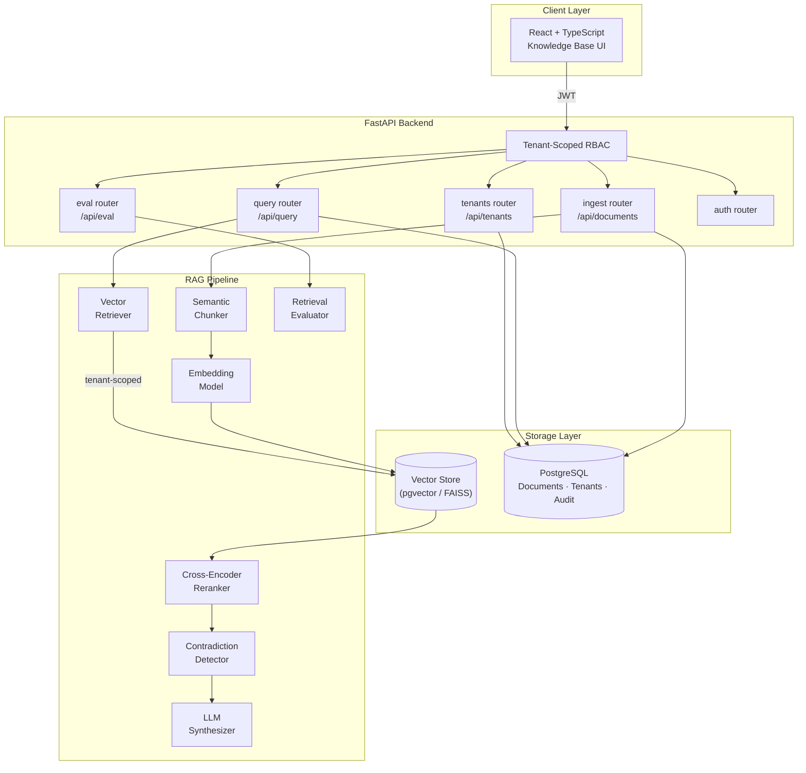

# Callisto

**Enterprise RAG Knowledge Platform**

[**🔗 View Live Preview →**](https://www.perplexity.ai/computer/a/callisto-preview-project-3-of-lCA5DWRgQoa4AN6VYPXAUQ)

> A production-style enterprise Retrieval-Augmented Generation (RAG) platform that ingests documents, chunks and embeds them into a vector store, retrieves context-relevant passages for LLM queries, and enforces tenant-level RBAC across the knowledge base.

---

## 🎯 What I Built & Why

Enterprise RAG is more than plugging a vector DB into an LLM. I built Callisto to work through the hard parts: chunking strategy trade-offs, retrieval quality evaluation, and multi-tenant isolation.

- **Semantic chunking pipeline** — documents are split using a sentence-boundary-aware strategy that preserves context across chunk boundaries, improving retrieval coherence vs. fixed-size splits
- **Multi-document cross-referencing** — retrieved chunks are ranked across source documents, and contradictory passages are flagged before synthesis
- **Tenant-isolated RBAC** — each tenant’s knowledge base is logically isolated; retrieval queries are scoped to the requesting tenant’s collection at the vector DB query level
- **Retrieval evaluation pipeline** — `GET /api/eval/retrieval` scores chunk retrieval quality against a labeled test set for continuous quality monitoring

---

## 🏗️ Architecture



---

## 📷 Features

- **Document ingestion pipeline** — semantic chunking, embedding, and vector store indexing
- **Tenant-isolated retrieval** — RBAC-scoped queries prevent cross-tenant data access
- **Cross-encoder reranking** — retrieved chunks reranked for relevance before synthesis
- **Contradiction detection** — conflicting passages flagged in LLM response
- **Retrieval evaluation** — scored against labeled test sets for quality monitoring
- **Knowledge base UI** — document management, query interface, and eval dashboards
- **Docker Compose** — one-command local stack

---

## 🛠️ Tech Stack

| Layer | Technology |
|---|---|
| Backend API | FastAPI + SQLAlchemy + PostgreSQL |
| Vector Store | pgvector or FAISS |
| Embeddings | Sentence Transformers |
| LLM | OpenAI / local model |
| Frontend | React + Vite + TypeScript |
| Infra | Docker Compose + GitHub Actions CI |

---

## 🚀 Quick Start

```bash
docker compose up --build
# Backend API docs: http://localhost:8000/docs
# Frontend:         http://localhost:5173
```

### Local Development
```bash
cd backend && pip install -e .[dev]
cp .env.example .env   # add your LLM + embedding API keys
uvicorn app.main:app --reload

cd frontend && npm ci && npm run dev
```

### Quality Checks
```bash
make lint && make test
```

---

## 🗂️ Repository Structure

```
backend/    FastAPI API, RAG pipeline, chunking, retrieval eval, tenant RBAC, tests
frontend/   React knowledge base UI
docs/       Architecture, chunking strategy, eval methodology
```

---

## 📝 Key Learnings

- Chunking strategy is the highest-leverage variable in RAG quality — sentence-boundary-aware splits consistently outperform fixed-size windows on retrieval coherence
- Tenant isolation must be enforced at the vector query level, not just the API layer; row-level filtering at the DB is the only reliable guard
- Retrieval evaluation against labeled test sets is the only way to detect quality regressions when swapping embedding models or chunking strategies

---

## 📄 License

MIT
