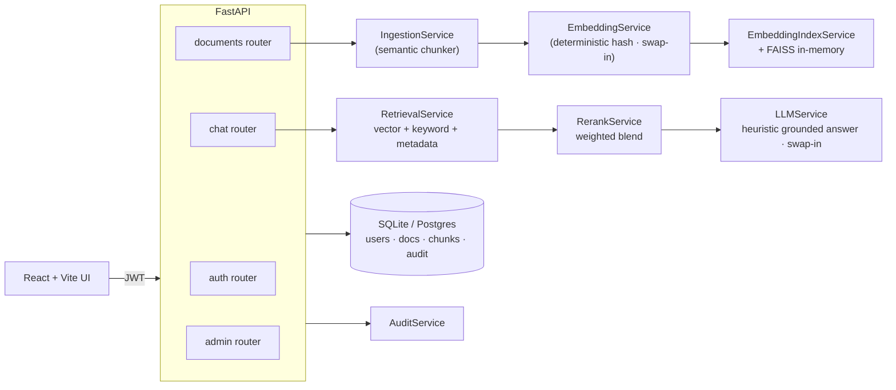

# Callisto — Enterprise RAG Knowledge Platform

> **One-liner:** A multi-tenant Retrieval-Augmented Generation (RAG) platform that ingests
> documents, chunks and embeds them, and answers questions with inline citations —
> behind JWT auth and organization-scoped RBAC.

Callisto is a portfolio project by [Ryan Bush](https://github.com/RyanJBush) (Information
Science, University of Maryland) that walks through the full RAG stack end to end:
ingestion, chunking, hybrid retrieval, reranking, grounded answer generation,
multi-tenant isolation, and a reproducible retrieval-evaluation harness. It is
designed to be run locally in one command and read end-to-end as a learning
artifact.

[**View Live Preview →**](https://www.perplexity.ai/computer/a/callisto-preview-project-3-of-lCA5DWRgQoa4AN6VYPXAUQ)

---

## Recruiter summary

- **Why it exists.** Enterprises sitting on internal documents (HR policies,
  runbooks, security guides) need a way to query them in natural language without
  leaking data across teams. Callisto is a working reference for how that system
  is wired together: ingestion → vector + keyword retrieval → reranking →
  grounded answer with citations → audit log.
- **What's actually built.** ~2,200 LOC of typed Python (FastAPI + SQLAlchemy 2.0),
  a React + Vite + Tailwind UI, 15 REST endpoints, ~100 passing pytest tests,
  Alembic migrations, JWT auth, role-based access control, an in-memory rate
  limiter, request metrics, an audit log, Docker Compose for the full stack,
  and a GitHub Actions CI pipeline.
- **What's intentionally simple.** Embeddings are a deterministic 32-dim hash and
  the "LLM" is a heuristic that composes an answer from the top-ranked chunks.
  Both sit behind swap-in interfaces (`EmbeddingService`, `LLMService`) so the
  demo runs with **no external API keys**. See
  [docs/ARCHITECTURE.md](docs/ARCHITECTURE.md) for the production-swap matrix.

---

## Core features

- **Document ingestion pipeline** — sentence-boundary-aware chunking with
  configurable size/overlap and a sliding-window fallback for oversize units.
- **Hybrid retrieval** — cosine vector search blended with keyword overlap,
  document-title metadata signals, and a weighted reranker.
- **Grounded answers with citations** — every assistant reply lists the
  contributing chunk IDs and source documents, plus a confidence and
  citation-coverage score.
- **Multi-tenant isolation** — every document, chunk, and retrieval query is
  filtered by the requesting user's `organization_id`.
- **RBAC** — admin / member / viewer roles enforced via FastAPI dependencies,
  with per-document access grants on top.
- **Retrieval evaluation harness** — a labeled query set plus a script that
  reports source hit-rate, keyword coverage, and latency
  ([docs/EVALUATION.md](docs/EVALUATION.md)).
- **Audit log** — ingestion, retrieval, and admin actions are recorded for
  compliance review.
- **Containerized stack** — `docker compose up` brings up Postgres + backend
  + frontend.

---

## Tech stack

| Layer | Tech |
|---|---|
| Backend | FastAPI · SQLAlchemy 2.0 · Pydantic · Alembic · numpy · faiss-cpu · pypdf |
| Frontend | React 18 · Vite · Tailwind · axios · react-router |
| Storage | SQLite (default) / PostgreSQL via `DATABASE_URL` |
| Auth | JWT (python-jose) · passlib + bcrypt |
| Infra | Docker · Docker Compose · GitHub Actions · Makefile |
| Testing | pytest · httpx · ruff |

---

## Architecture



Full diagram + production-swap matrix: [docs/ARCHITECTURE.md](docs/ARCHITECTURE.md).

---

## Repository structure

```
backend/      FastAPI app, services, models, alembic migrations, tests
  app/
    routers/    HTTP layer (auth, documents, chat, admin, health)
    services/   Domain workflows (ingestion, embedding, retrieval, rerank, ...)
    models/     SQLAlchemy ORM
    schemas/    Pydantic contracts
    core/       Auth, JWT, RBAC, logging, metrics, rate limiting
    db/         Engine, session, demo seed
frontend/     React + Vite + Tailwind SPA
data/samples/ Seed documents + labeled retrieval-eval set
docs/         Architecture, API reference, evaluation methodology, resume bullets
scripts/      Quickstart + retrieval evaluation
.github/      CI workflow + issue / PR templates
```

---

## Quick start

### Option A — Docker Compose (full stack)
```bash
docker compose up --build
# Backend  → http://localhost:8000  (OpenAPI docs at /docs)
# Frontend → http://localhost:5173
```

### Option B — Local
```bash
./scripts/quickstart.sh           # installs backend + frontend deps, seeds DB
make run-backend                  # in one terminal
make run-frontend                 # in another
```

### Demo credentials
Seeded on first run:

| Email | Password | Role |
|---|---|---|
| `admin@calisto.ai` | `password123` | admin |
| `member@calisto.ai` | `password123` | member |
| `viewer@calisto.ai` | `password123` | viewer |

---

## Demo workflow (curl)

```bash
# 1. Log in as the seeded admin
TOKEN=$(curl -s -X POST http://localhost:8000/api/auth/login \
  -H 'Content-Type: application/json' \
  -d '{"email":"admin@calisto.ai","password":"password123"}' | jq -r .access_token)

# 2. Upload a document
curl -s -X POST http://localhost:8000/api/documents/upload \
  -H "Authorization: Bearer $TOKEN" -H 'Content-Type: application/json' \
  -d @- <<'JSON'
{
  "title": "Employee Handbook",
  "source_name": "employee_handbook.txt",
  "content": "Employees accrue 15 days of paid time off per year..."
}
JSON

# 3. Ask a question
curl -s -X POST http://localhost:8000/api/chat/query \
  -H "Authorization: Bearer $TOKEN" -H 'Content-Type: application/json' \
  -d '{"query":"How many PTO days do employees get?","top_k":3}' | jq
```

The response includes the answer, citations (with chunk IDs and snippets),
confidence score, and a `latency_breakdown_ms` for retrieve / rerank / generate.

Full API reference: [docs/API.md](docs/API.md).

---

## Sample data

Three plain-text knowledge-base documents and a labeled evaluation set live in
[`data/samples/`](data/samples). Use them with the eval script:

```bash
make run-backend &
python scripts/evaluate_retrieval.py
```

The script logs in, uploads the samples, runs the eval queries, and reports
source hit-rate, keyword coverage, and latency. See
[docs/EVALUATION.md](docs/EVALUATION.md).

---

## Environment variables

Copy `backend/.env.example` to `backend/.env` and adjust:

| Variable | Default | Notes |
|---|---|---|
| `APP_NAME` | `Calisto AI` | shown in OpenAPI |
| `ENVIRONMENT` | `development` | |
| `DATABASE_URL` | `sqlite:///./calisto.db` | switch to `postgresql+psycopg://...` for Postgres |
| `JWT_SECRET` | `change-me-in-production` | **must be changed for any real use** |
| `JWT_ALGORITHM` | `HS256` | |
| `JWT_EXP_MINUTES` | `60` | token lifetime |
| `RATE_LIMIT_PER_MINUTE` | `300` | in-memory limiter |
| `CORS_ORIGINS` | `http://localhost:5173` | comma-separated |
| `LLM_PROVIDER` | `heuristic` | current implementation; future: `openai`, `anthropic`, `local` |
| `LLM_MODEL` | `calisto-grounded-v1` | |

---

## Testing & quality

```bash
make lint           # ruff (backend) + eslint (frontend)
make test           # pytest (~100 backend tests) + frontend build
```

The CI workflow in [`.github/workflows/ci.yml`](.github/workflows/ci.yml) runs
both jobs on every push and pull request.

---

## Screenshots

Drop UI screenshots into [`docs/screenshots/`](docs/screenshots) and reference
them here once captured. See [docs/screenshots/README.md](docs/screenshots/README.md)
for the suggested set (dashboard, documents, chat, admin).

---

## Limitations and future work

This project is deliberately scoped so it runs end-to-end without external
services. Honest assessment of what is **not** production-ready today:

- **Embeddings** are a deterministic 32-dim hash. They are great for testing
  the plumbing and proving the interfaces, but semantic recall is limited.
  Future work: plug in `sentence-transformers/all-MiniLM-L6-v2` or
  `text-embedding-3-small` behind the existing `EmbeddingService` interface.
- **Answer generation** is heuristic — it stitches together top citations into
  a structured response. There is no real LLM call. Future work: add an
  `OpenAILLM` provider in `app/services/llm_service.py`.
- **Vector index** is in-memory FAISS rebuilt on startup. Future work: persist
  to `pgvector` or a managed vector DB.
- **Reranker** is a weighted blend of term-overlap and metadata signals.
  Future work: a real cross-encoder (`cross-encoder/ms-marco-MiniLM-L-6-v2`).
- **Tenant isolation** is enforced at the application layer (every query
  filters by `organization_id`). Future work: also enforce at the database
  layer via row-level security policies in Postgres.
- **No deployment.** The project is run locally; there is no public hosted
  instance and no real users.
- **Eval set is small (6 queries).** It demonstrates the methodology, not a
  production benchmark.

---

## Resume bullets

ATS-ready one-liners are maintained in [docs/RESUME_BULLETS.md](docs/RESUME_BULLETS.md).

Headline bullet:

> Built **Callisto**, an enterprise-style RAG knowledge platform (FastAPI,
> React, SQLAlchemy, Docker) with sentence-aware chunking, hybrid vector +
> keyword retrieval, reranking, JWT auth, tenant-scoped RBAC, and a labeled
> retrieval-evaluation harness; ~2.2k LOC backend Python with ~100 passing
> pytest tests and GitHub Actions CI.

---

## License

[MIT](LICENSE)
